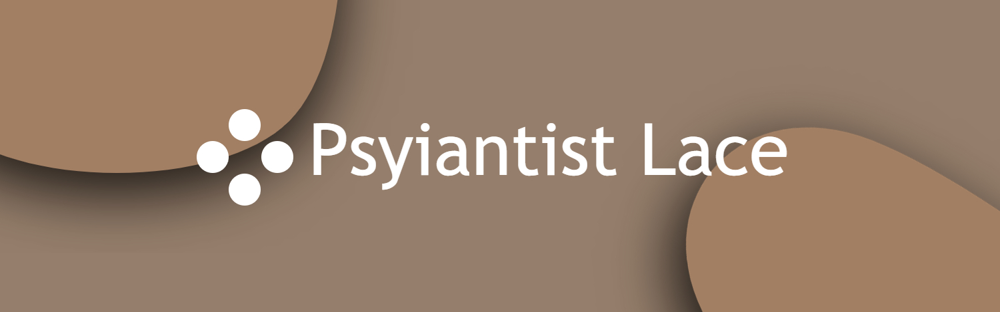

# Lace App

**Lace** is an application developed by **Psyiantist** that utilizes multiple language models to process text prompts. It's similar to ChatGPT but offers a unique experience with its variety of language models. The app is built using Visual Studio 2022 with VB.Net, specifically designed as a Windows Forms application.

## Features

- **Multiple Language Models:** Lace incorporates a variety of language models, providing diverse responses to text prompts.
  
- **Customizable UI:** The user interface is highly flexible and can be customized according to your preferences, offering a personalized experience.

- **Conversation History:** The app allows users to save and review conversation history, making it easy to revisit previous interactions.

- **Internet Connection Required:** Lace relies on an internet connection to access and utilize the various language models.

## Requirements

To run Lace on your system, ensure you have the following:

- **.NET Framework:** Lace requires the .NET Framework. If it's not already installed on your machine, you can download it from [Microsoft's official site](https://dotnet.microsoft.com/download/dotnet-framework).

## Getting Started

1. Clone or download the **"Lace Setup.exe"** to your local machine.

2. Ensure that you have a working internet connection.

3. Run the application.

4. Explore the customizable UI, engage with language models, and enjoy the conversation history feature.

## Contribution

Contributions to Lace are welcome! If you have ideas for improvement, bug reports, or feature requests, feel free to open an issue or submit a pull request.

## License

This project is licensed under the [MIT License](LICENSE).
